# Hop — Carpooling by Ridly

Hop is a peer-to-peer carpooling platform for Android and iOS, built with Kotlin Multiplatform and a NestJS backend. Drivers post trips and passengers book seats, with payments handled directly via MobilePay.

---

## Repository Structure

```
HOP-KMP/
├── apps/api/          # NestJS backend (TypeScript, Prisma, PostgreSQL)
├── composeApp/        # Android Compose Multiplatform UI
├── iosApp/            # iOS SwiftUI app
├── shared/            # KMP shared business logic (domain, data, ViewModels)
└── infra/             # Deployment configuration
```

### [`/apps/api`](./apps/api)
NestJS REST + WebSocket backend.

| Module | Description |
|---|---|
| `auth` | Supabase JWT authentication |
| `trips` | Trip creation, search, and lifecycle |
| `bookings` | Booking requests and confirmations |
| `settlements` | Post-trip payment settlement flows |
| `ratings` | Passenger ↔ driver mutual ratings |
| `chat` | Real-time messaging via Socket.IO |
| `notifications` | Push notifications (BullMQ queue) |
| `users` | Profile management |
| `places` | Google Places autocomplete proxy |
| `search-alerts` | Saved search alert subscriptions |
| `help-center` | FAQ endpoint (public, no auth required) |
| `admin` | Internal admin operations |

### [`/shared`](./shared/src/commonMain/kotlin/com/example/hop)
KMP shared module consumed by both Android and iOS.

```
shared/src/commonMain/
├── domain/
│   ├── model/          # Domain data classes
│   └── repository/     # Repository interfaces
├── data/
│   ├── dto/            # API response DTOs
│   └── repository/     # Ktor repository implementations
├── presentation/       # MVI ViewModels (state / events / effects)
└── di/                 # Koin modules (repository + presentation)
```

### [`/composeApp`](./composeApp/src/commonMain/kotlin/com/example/hop/ui)
Android UI in Compose Multiplatform with type-safe Navigation Compose.

**Screens:**

| Area | Screens |
|---|---|
| Auth | Onboarding, Sign Up, Login, Verify Email, Forgot Password, Set New Password |
| Passenger | Home, Search Results, Trip Detail, Booking Confirmation, Booking Success, Active Trip, MobilePay Handoff, Rate Driver, Cancellation Confirmation |
| Driver | Home, Post Trip (Model A / B / Select), Price Review, Car Details, MobilePay Setup, My Trips, Active Trip Detail, Mark Complete, Rate Passenger, Review Pending, Tax Dashboard, Tax Report Download |
| Settlement | Passenger Settlement, Driver Settlement, Past Trip Detail |
| Shared | Chat, Chat List, Notifications, Profile, Other Profile, Settings, Help Center, Privacy Policy, Terms of Service |

### [`/iosApp`](./iosApp/iosApp)
Native SwiftUI app. ViewModels are shared from KMP via `KoinIOS.kt` accessors and wrapped in `@MainActor ObservableObject` wrappers (`*ViewModelWrapper.swift`).

---

## App Screens

Every screen state below is rendered from the Android app's Compose `@Preview` functions (Pixel 5, Robolectric) — the real UI with sample data, not mockups. To refresh:

```bash
./gradlew :composeApp:recordRoborazziDebug
python scripts/screenshots_to_readme.py
```

<!-- screenshots:start -->

<details open>
<summary><b>Onboarding & account</b> — 6 screens, 13 states</summary>

<table>
<tr><td align="center" valign="top" width="25%">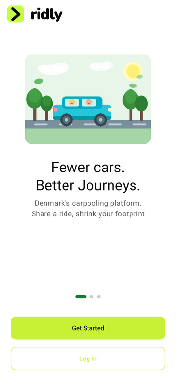<br><b>Onboarding</b><br><sub>Light</sub></td><td align="center" valign="top" width="25%"><br><b>Sign Up</b><br><sub>Empty</sub></td><td align="center" valign="top" width="25%">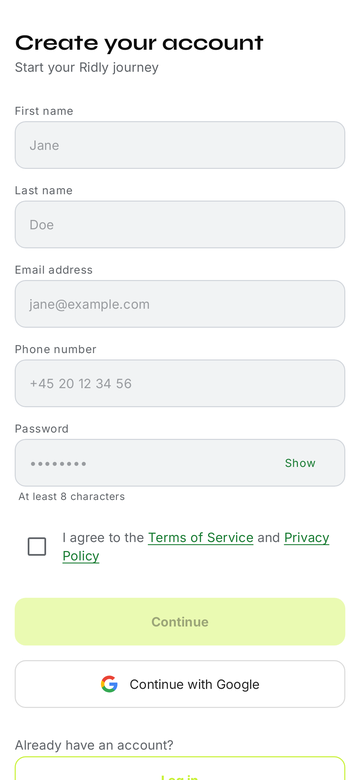<br><b>Sign Up</b><br><sub>Filled</sub></td><td align="center" valign="top" width="25%">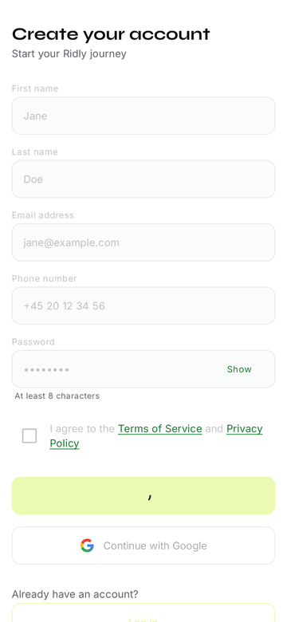<br><b>Sign Up</b><br><sub>Loading</sub></td></tr>
<tr><td align="center" valign="top" width="25%">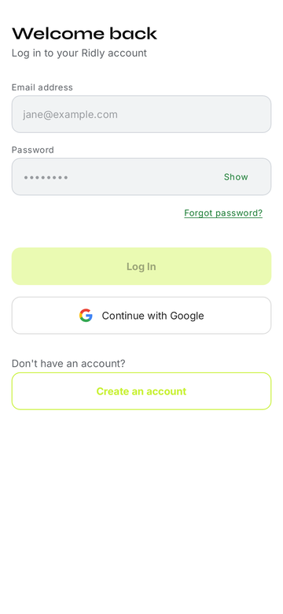<br><b>Login</b><br><sub>Empty</sub></td><td align="center" valign="top" width="25%"><br><b>Login</b><br><sub>Error</sub></td><td align="center" valign="top" width="25%">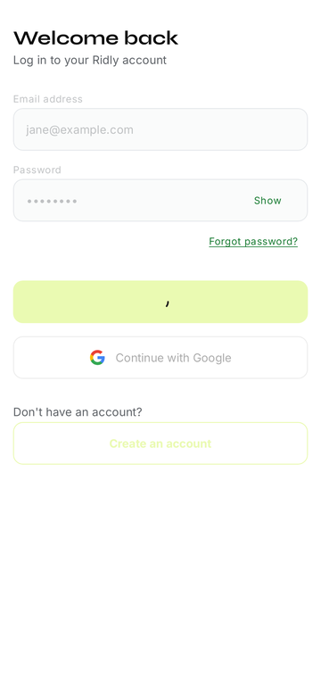<br><b>Login</b><br><sub>Loading</sub></td><td align="center" valign="top" width="25%">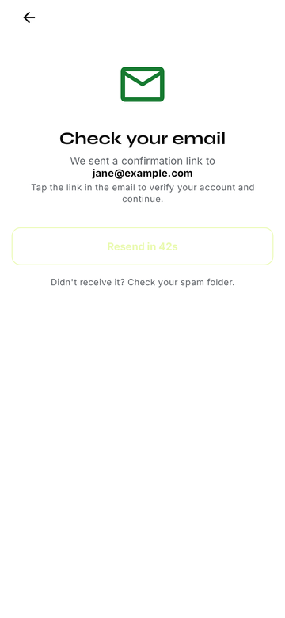<br><b>Verify Email</b><br><sub>Cooldown</sub></td></tr>
<tr><td align="center" valign="top" width="25%"><br><b>Verify Email</b><br><sub>Ready</sub></td><td align="center" valign="top" width="25%">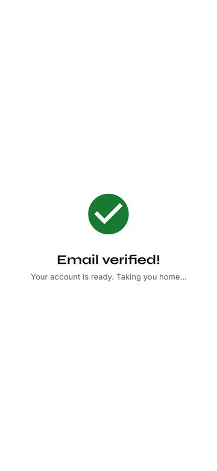<br><b>Email Verified</b><br><sub>Default</sub></td><td align="center" valign="top" width="25%">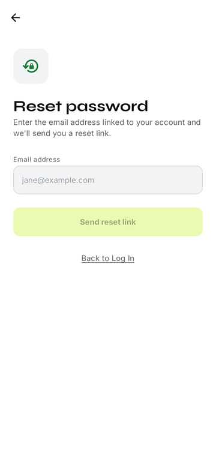<br><b>Forgot Password</b><br><sub>Empty</sub></td><td align="center" valign="top" width="25%">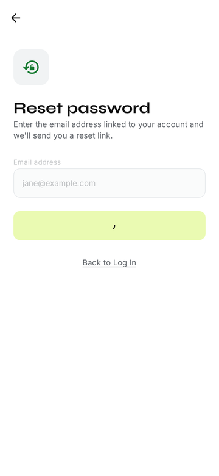<br><b>Forgot Password</b><br><sub>Loading</sub></td></tr>
<tr><td align="center" valign="top" width="25%">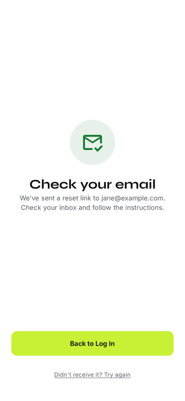<br><b>Forgot Password</b><br><sub>Success</sub></td></tr>
</table>
</details>

<details>
<summary><b>Home, chat & profile</b> — 7 screens, 17 states</summary>

<table>
<tr><td align="center" valign="top" width="25%">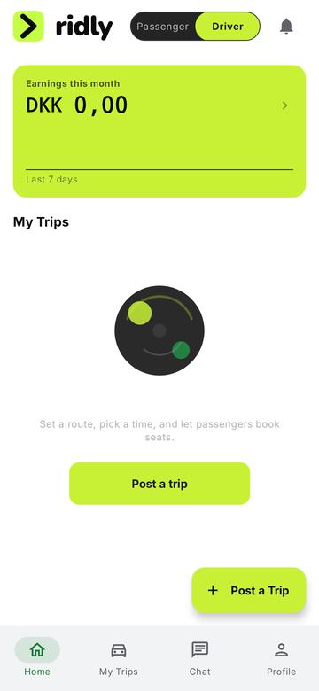<br><b>Home</b><br><sub>Driver role, driver selected</sub></td><td align="center" valign="top" width="25%"><br><b>Home</b><br><sub>Driver role, passenger selected</sub></td><td align="center" valign="top" width="25%">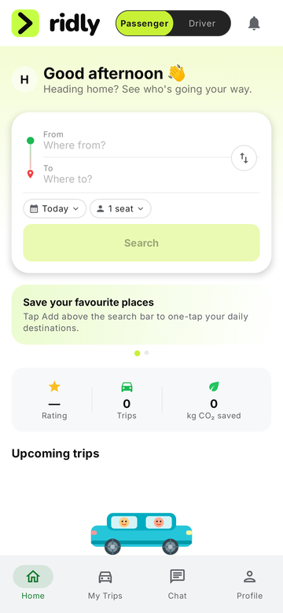<br><b>Home</b><br><sub>Passenger only (no driver role)</sub></td><td align="center" valign="top" width="25%">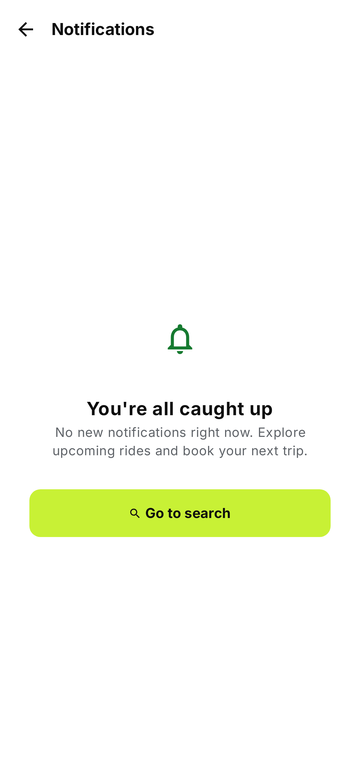<br><b>Notifications</b><br><sub>Empty State</sub></td></tr>
<tr><td align="center" valign="top" width="25%">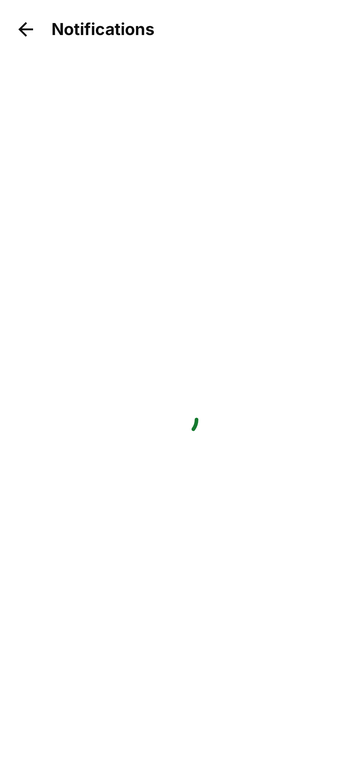<br><b>Notifications</b><br><sub>Loading</sub></td><td align="center" valign="top" width="25%">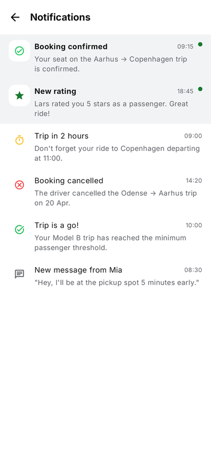<br><b>Notifications</b><br><sub>With Items</sub></td><td align="center" valign="top" width="25%">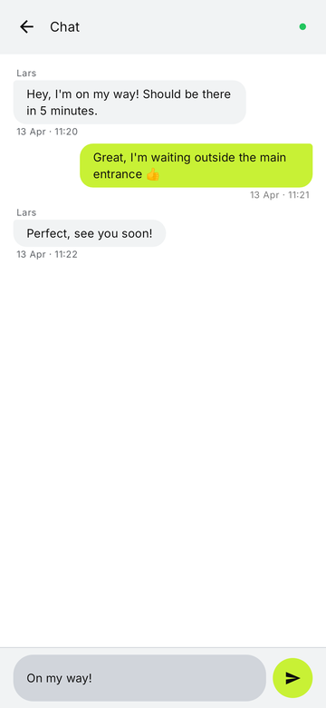<br><b>Chat</b><br><sub>Default</sub></td><td align="center" valign="top" width="25%">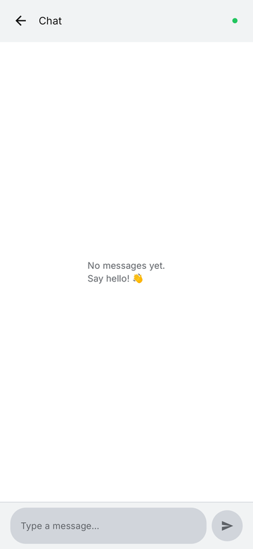<br><b>Chat</b><br><sub>Empty</sub></td></tr>
<tr><td align="center" valign="top" width="25%">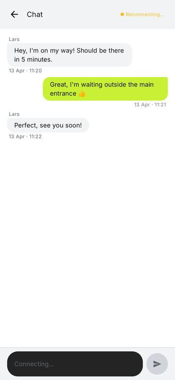<br><b>Chat</b><br><sub>Reconnecting</sub></td><td align="center" valign="top" width="25%">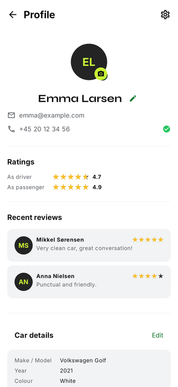<br><b>Own Profile</b><br><sub>Default</sub></td><td align="center" valign="top" width="25%">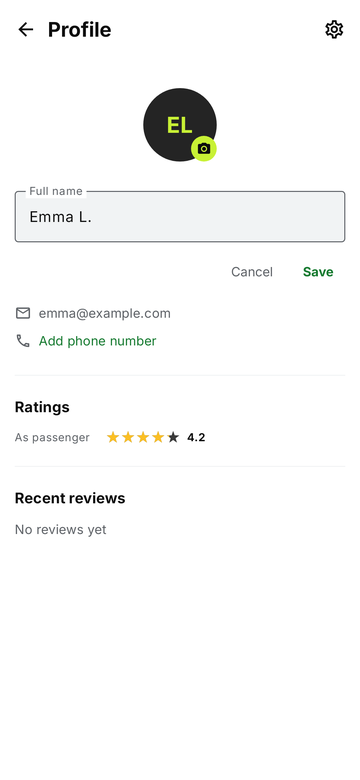<br><b>Own Profile</b><br><sub>Editing Name</sub></td><td align="center" valign="top" width="25%">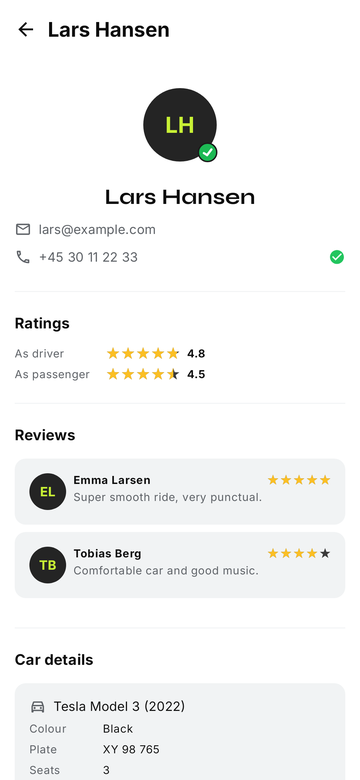<br><b>Other Profile</b><br><sub>Default</sub></td></tr>
<tr><td align="center" valign="top" width="25%">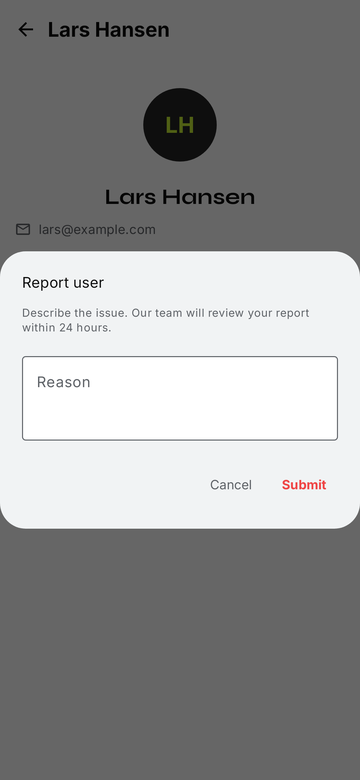<br><b>Other Profile</b><br><sub>Report Dialog</sub></td><td align="center" valign="top" width="25%">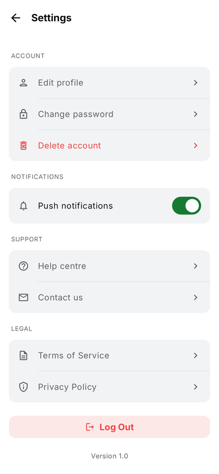<br><b>Settings</b><br><sub>Default</sub></td><td align="center" valign="top" width="25%">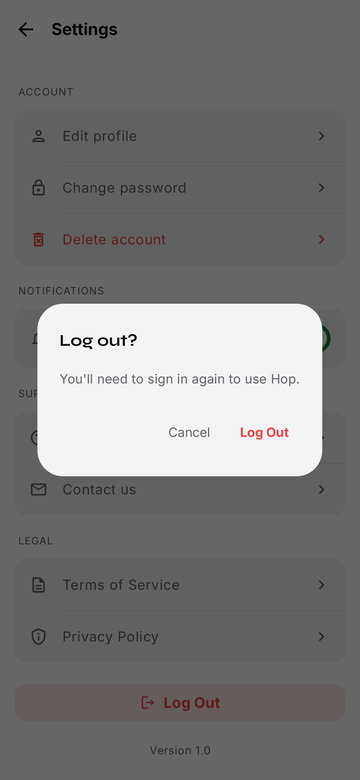<br><b>Settings</b><br><sub>Logout dialog</sub></td><td align="center" valign="top" width="25%">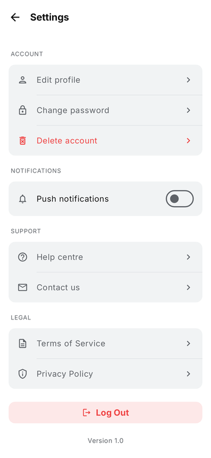<br><b>Settings</b><br><sub>Notifications off</sub></td></tr>
<tr><td align="center" valign="top" width="25%">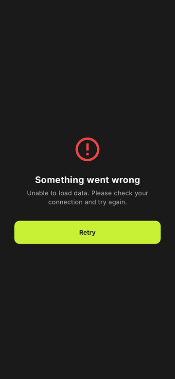<br><b>Error</b><br><sub>Default</sub></td></tr>
</table>
</details>

<details>
<summary><b>Passenger</b> — 9 screens, 29 states</summary>

<table>
<tr><td align="center" valign="top" width="25%">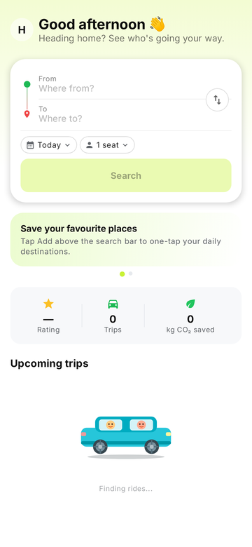<br><b>Passenger Home</b><br><sub>Empty state</sub></td><td align="center" valign="top" width="25%"><br><b>Passenger Home</b><br><sub>Loading</sub></td><td align="center" valign="top" width="25%">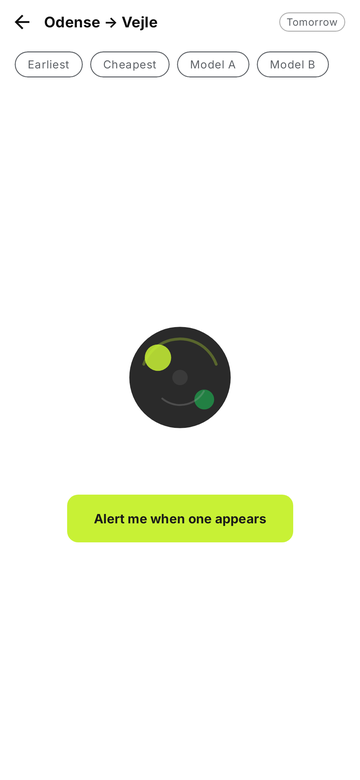<br><b>Search Results</b><br><sub>Empty</sub></td><td align="center" valign="top" width="25%">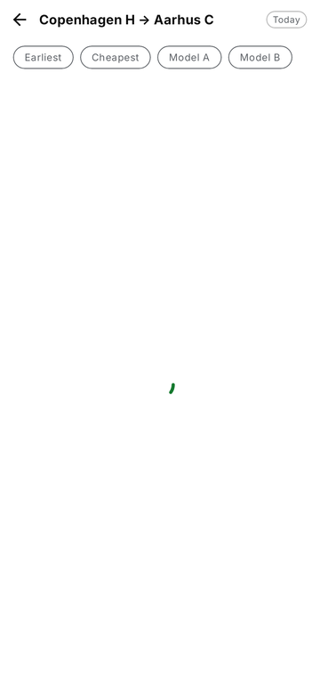<br><b>Search Results</b><br><sub>Loading</sub></td></tr>
<tr><td align="center" valign="top" width="25%">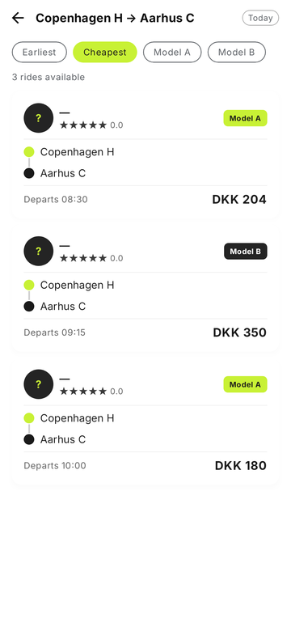<br><b>Search Results</b><br><sub>With Results</sub></td><td align="center" valign="top" width="25%">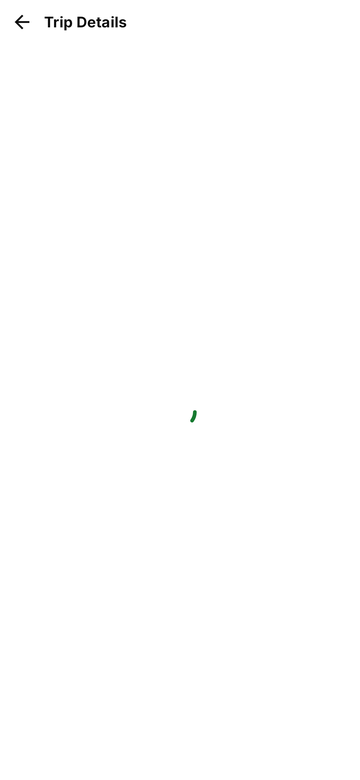<br><b>Trip Detail</b><br><sub>Loading</sub></td><td align="center" valign="top" width="25%">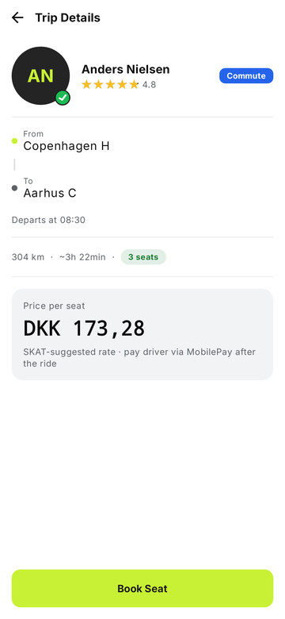<br><b>Trip Detail</b><br><sub>Model A</sub></td><td align="center" valign="top" width="25%">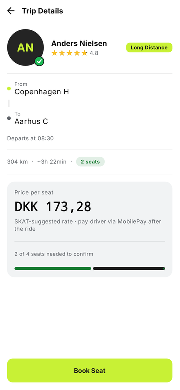<br><b>Trip Detail</b><br><sub>Model B</sub></td></tr>
<tr><td align="center" valign="top" width="25%"><br><b>Trip Detail</b><br><sub>One Seat Left</sub></td><td align="center" valign="top" width="25%"><br><b>Booking Confirmation</b><br><sub>Loading</sub></td><td align="center" valign="top" width="25%">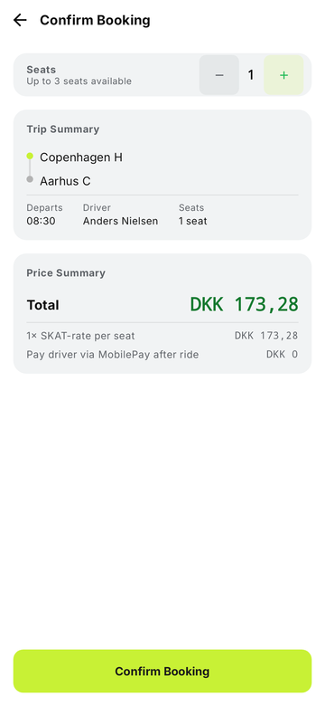<br><b>Booking Confirmation</b><br><sub>Model A</sub></td><td align="center" valign="top" width="25%">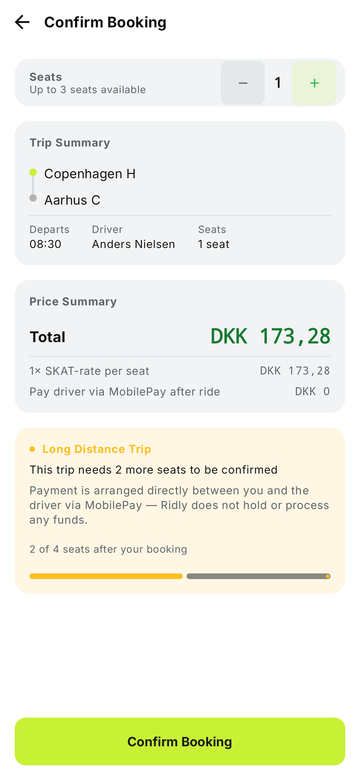<br><b>Booking Confirmation</b><br><sub>Model B</sub></td></tr>
<tr><td align="center" valign="top" width="25%">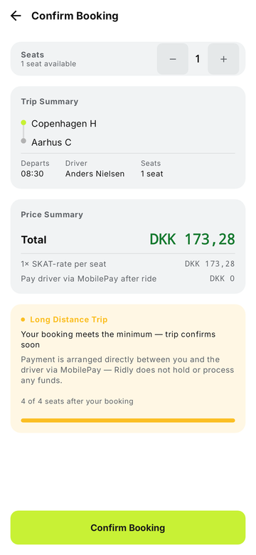<br><b>Booking Confirmation</b><br><sub>Model B Threshold Met</sub></td><td align="center" valign="top" width="25%">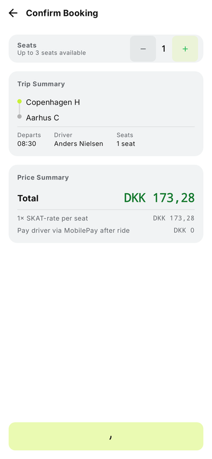<br><b>Booking Confirmation</b><br><sub>Processing</sub></td><td align="center" valign="top" width="25%">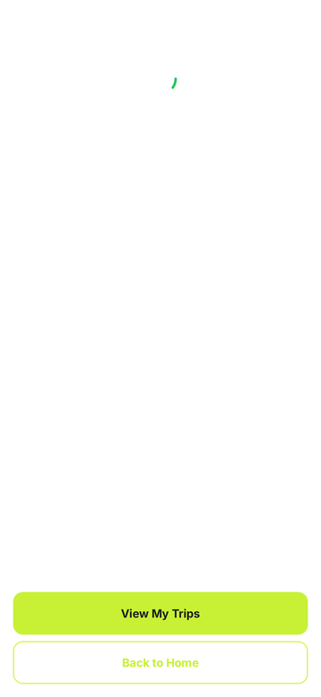<br><b>Booking Success</b><br><sub>Loading</sub></td><td align="center" valign="top" width="25%">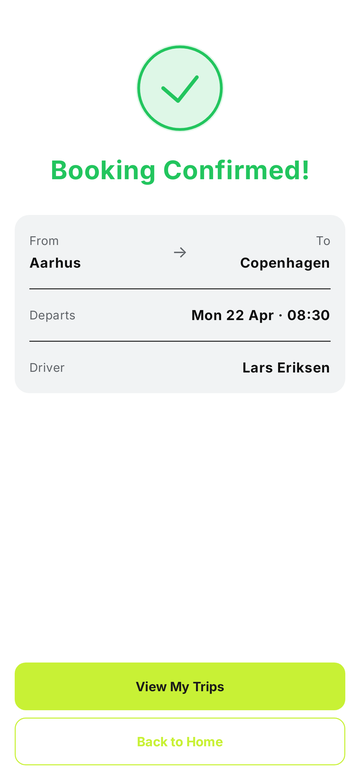<br><b>Booking Success</b><br><sub>Model A — Confirmed</sub></td></tr>
<tr><td align="center" valign="top" width="25%">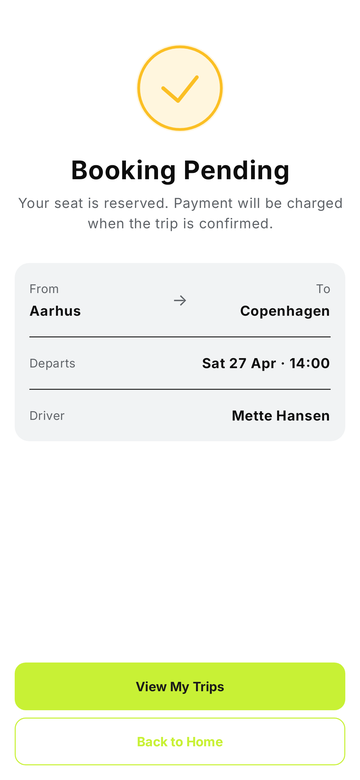<br><b>Booking Success</b><br><sub>Model B — Pending</sub></td><td align="center" valign="top" width="25%">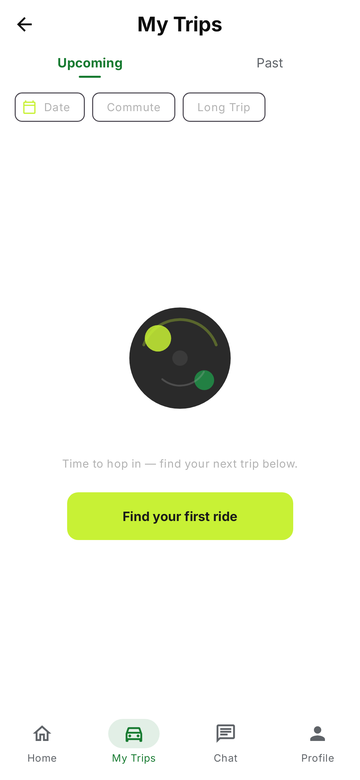<br><b>My Trips Passenger</b><br><sub>Empty upcoming</sub></td><td align="center" valign="top" width="25%">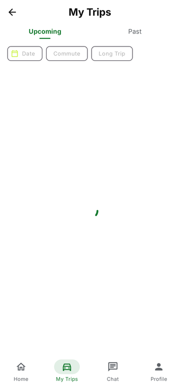<br><b>My Trips Passenger</b><br><sub>Loading</sub></td><td align="center" valign="top" width="25%"><br><b>My Trips Passenger</b><br><sub>Past trips</sub></td></tr>
<tr><td align="center" valign="top" width="25%">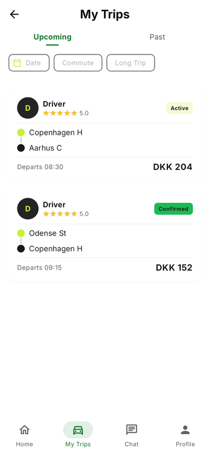<br><b>My Trips Passenger</b><br><sub>Upcoming trips</sub></td><td align="center" valign="top" width="25%">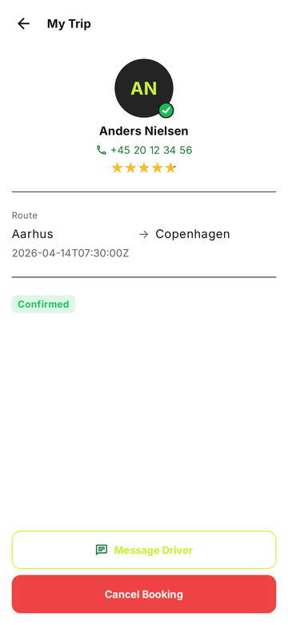<br><b>Trip Detail Active</b><br><sub>Confirmed</sub></td><td align="center" valign="top" width="25%">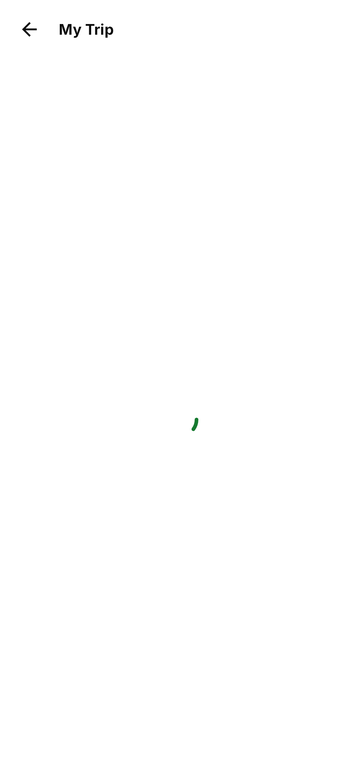<br><b>Trip Detail Active</b><br><sub>Loading</sub></td><td align="center" valign="top" width="25%">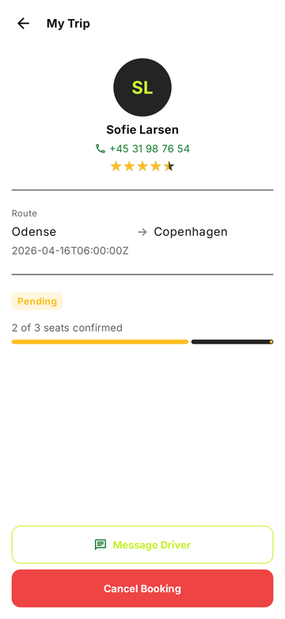<br><b>Trip Detail Active</b><br><sub>Model B Pending</sub></td></tr>
<tr><td align="center" valign="top" width="25%">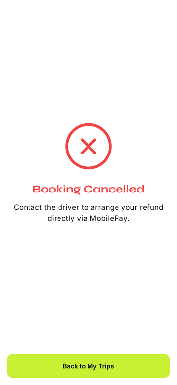<br><b>Cancellation Confirmation</b><br><sub>Loading</sub></td><td align="center" valign="top" width="25%">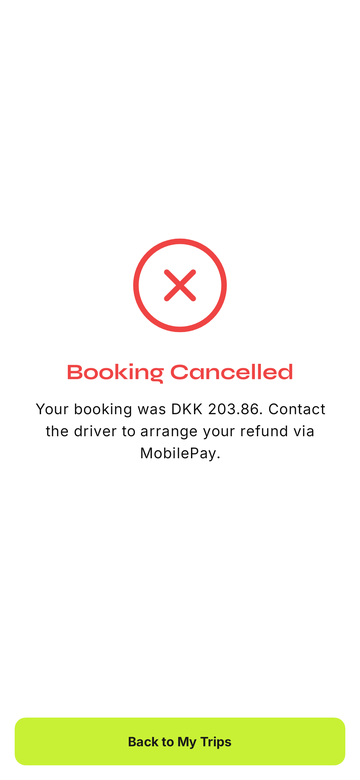<br><b>Cancellation Confirmation</b><br><sub>Model A</sub></td><td align="center" valign="top" width="25%">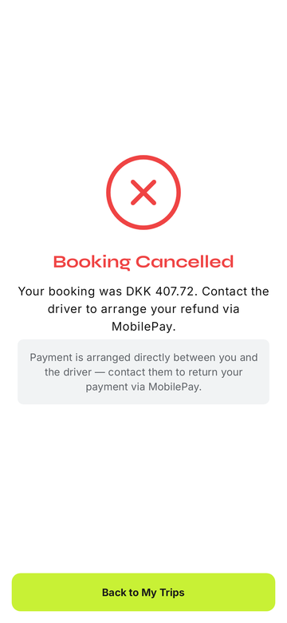<br><b>Cancellation Confirmation</b><br><sub>Model B</sub></td><td align="center" valign="top" width="25%">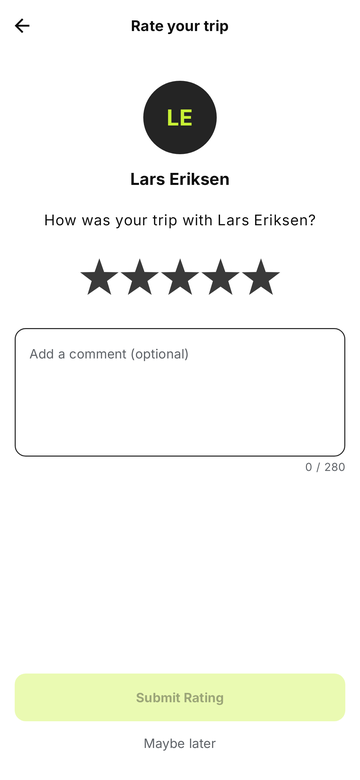<br><b>Rate Driver</b><br><sub>Default</sub></td></tr>
<tr><td align="center" valign="top" width="25%"><br><b>Rate Driver</b><br><sub>Stars selected + comment</sub></td></tr>
</table>
</details>

<details>
<summary><b>Driver</b> — 14 screens, 31 states</summary>

<table>
<tr><td align="center" valign="top" width="25%"><br><b>Driver Home</b><br><sub>Earnings Banner</sub></td><td align="center" valign="top" width="25%"><br><b>Driver Home</b><br><sub>Empty</sub></td><td align="center" valign="top" width="25%">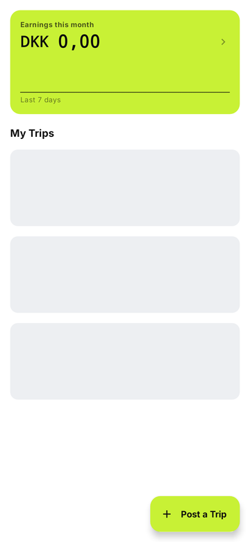<br><b>Driver Home</b><br><sub>Loading</sub></td><td align="center" valign="top" width="25%">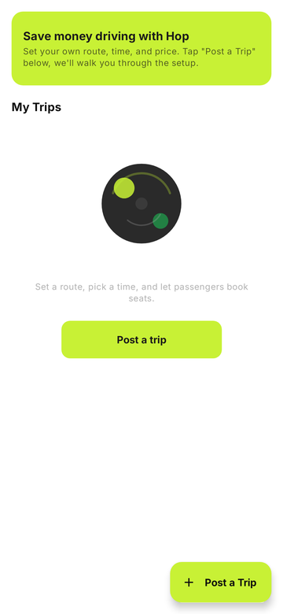<br><b>Driver Home</b><br><sub>Non Driver</sub></td></tr>
<tr><td align="center" valign="top" width="25%">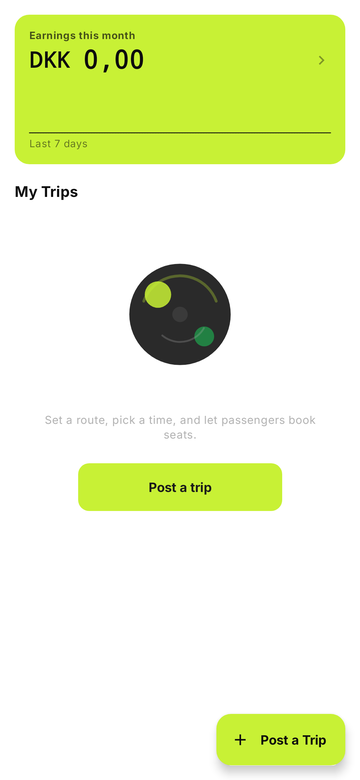<br><b>Driver Home</b><br><sub>With Trips</sub></td><td align="center" valign="top" width="25%">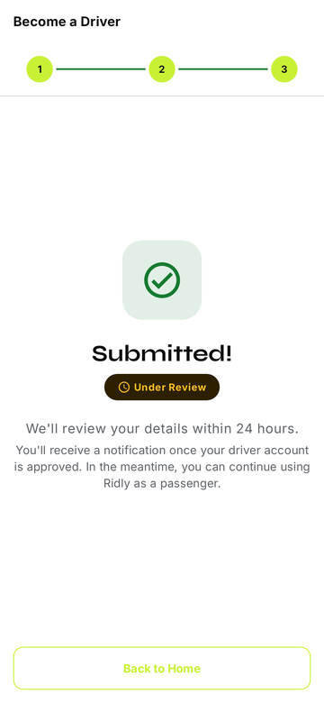<br><b>Review Pending</b><br><sub>Default</sub></td><td align="center" valign="top" width="25%">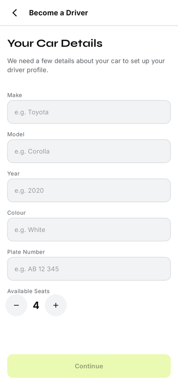<br><b>Car Details</b><br><sub>Default</sub></td><td align="center" valign="top" width="25%">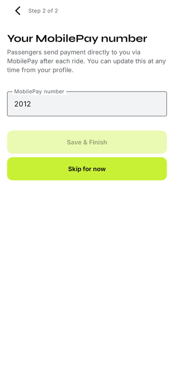<br><b>Enable Driver MobilePay</b><br><sub>Default</sub></td></tr>
<tr><td align="center" valign="top" width="25%">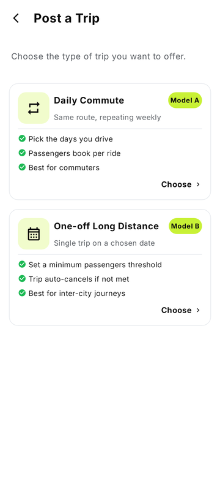<br><b>Post Trip Model Select</b><br><sub>Default</sub></td><td align="center" valign="top" width="25%">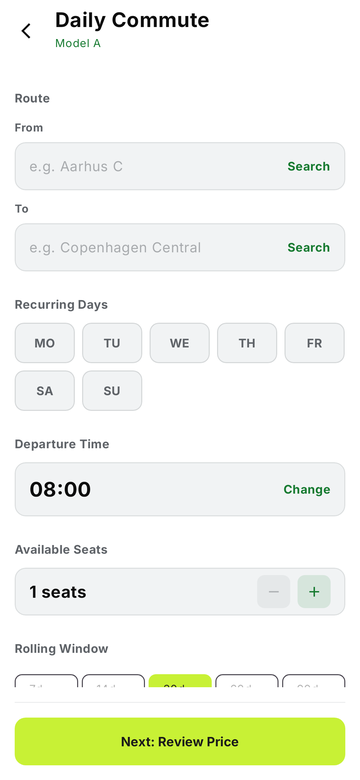<br><b>Post Trip Model A</b><br><sub>Default</sub></td><td align="center" valign="top" width="25%">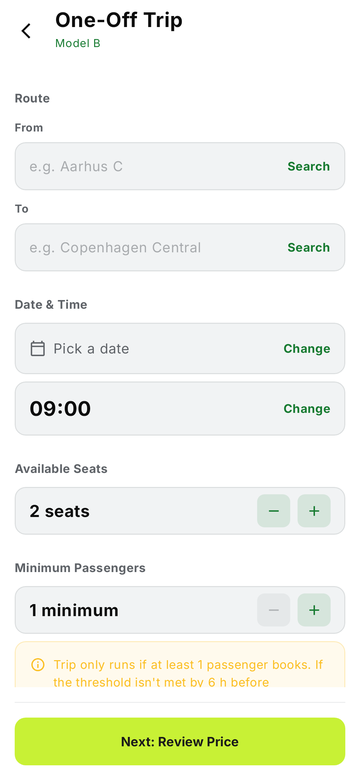<br><b>Post Trip Model B</b><br><sub>Default</sub></td><td align="center" valign="top" width="25%">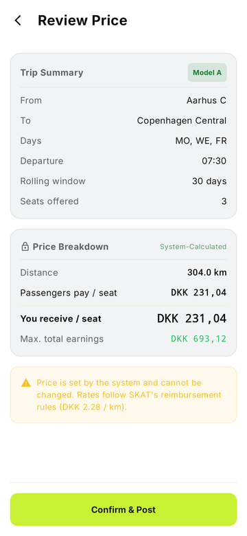<br><b>Price Review</b><br><sub>Model A</sub></td></tr>
<tr><td align="center" valign="top" width="25%">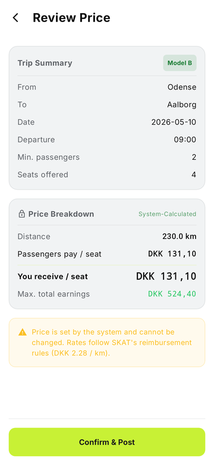<br><b>Price Review</b><br><sub>Model B</sub></td><td align="center" valign="top" width="25%">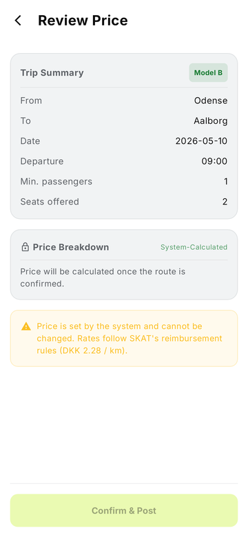<br><b>Price Review</b><br><sub>Price not yet resolved</sub></td><td align="center" valign="top" width="25%"><br><b>My Trips Driver</b><br><sub>Empty upcoming</sub></td><td align="center" valign="top" width="25%">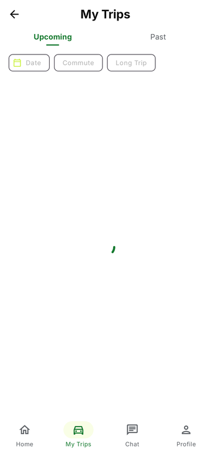<br><b>My Trips Driver</b><br><sub>Loading</sub></td></tr>
<tr><td align="center" valign="top" width="25%"><br><b>My Trips Driver</b><br><sub>Model B threshold met</sub></td><td align="center" valign="top" width="25%">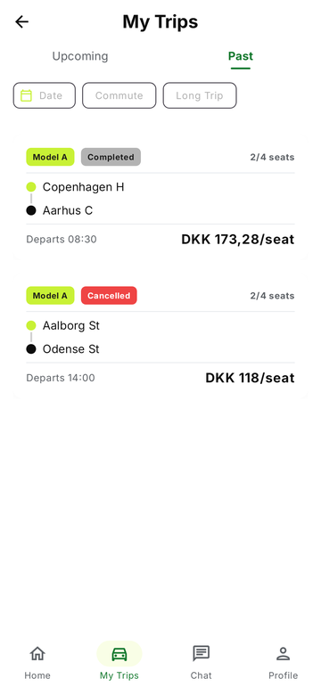<br><b>My Trips Driver</b><br><sub>Past trips</sub></td><td align="center" valign="top" width="25%">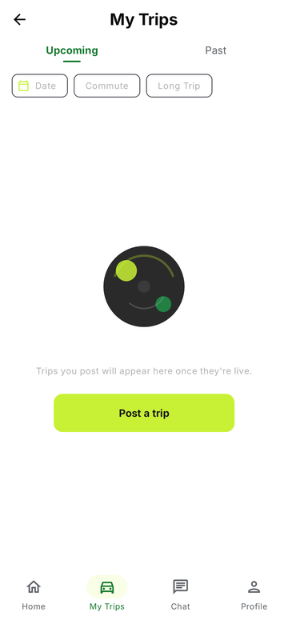<br><b>My Trips Driver</b><br><sub>Upcoming trips (Model A + B)</sub></td><td align="center" valign="top" width="25%">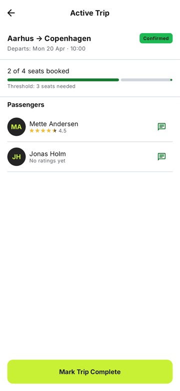<br><b>Trip Detail Active Driver</b><br><sub>Default</sub></td></tr>
<tr><td align="center" valign="top" width="25%">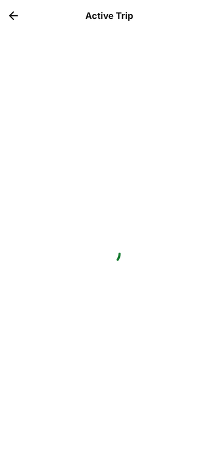<br><b>Trip Detail Active Driver</b><br><sub>Loading</sub></td><td align="center" valign="top" width="25%">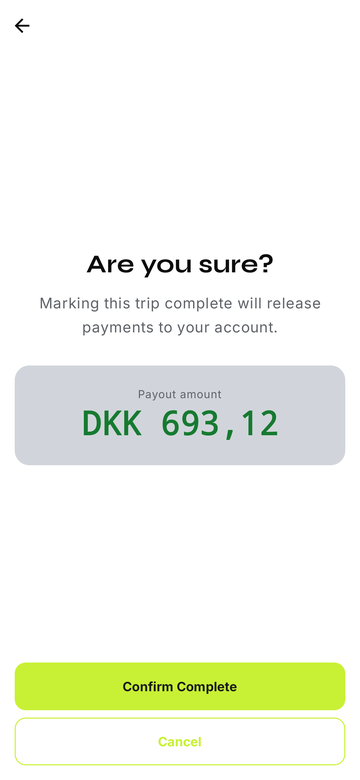<br><b>Mark Trip Complete</b><br><sub>Default</sub></td><td align="center" valign="top" width="25%">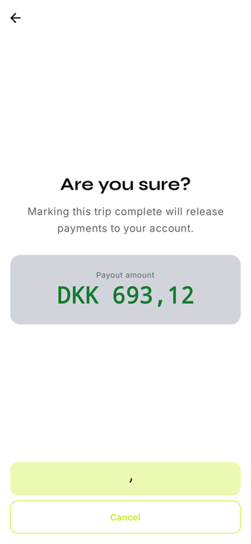<br><b>Mark Trip Complete</b><br><sub>Loading</sub></td><td align="center" valign="top" width="25%">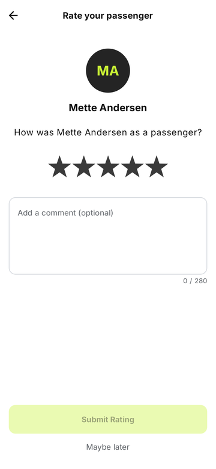<br><b>Rate Passenger</b><br><sub>Default</sub></td></tr>
<tr><td align="center" valign="top" width="25%"><br><b>Rate Passenger</b><br><sub>Stars selected</sub></td><td align="center" valign="top" width="25%">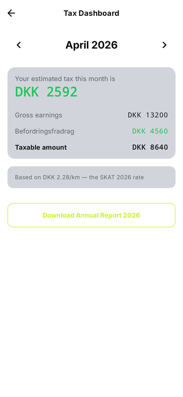<br><b>Tax Dashboard</b><br><sub>Default</sub></td><td align="center" valign="top" width="25%">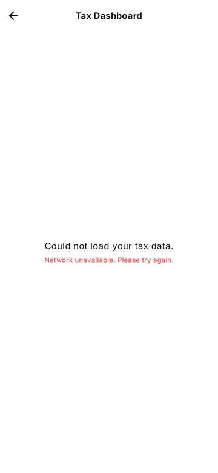<br><b>Tax Dashboard</b><br><sub>Error</sub></td><td align="center" valign="top" width="25%">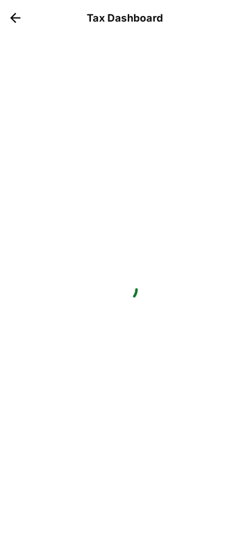<br><b>Tax Dashboard</b><br><sub>Loading</sub></td></tr>
<tr><td align="center" valign="top" width="25%">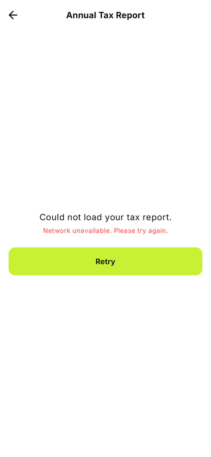<br><b>Tax Report Download</b><br><sub>Error</sub></td><td align="center" valign="top" width="25%">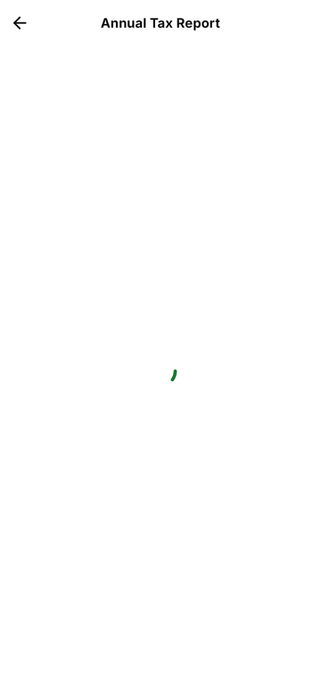<br><b>Tax Report Download</b><br><sub>Loading</sub></td><td align="center" valign="top" width="25%">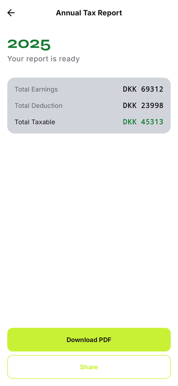<br><b>Tax Report Download</b><br><sub>Ready</sub></td></tr>
</table>
</details>

<details>
<summary><b>After the ride: payment</b> — 3 screens, 8 states</summary>

<table>
<tr><td align="center" valign="top" width="25%">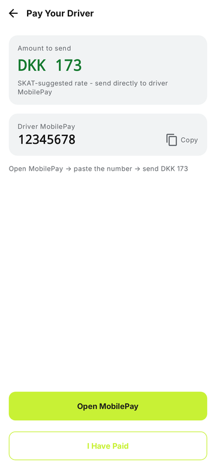<br><b>Passenger Settlement</b><br><sub>Awaiting payment</sub></td><td align="center" valign="top" width="25%">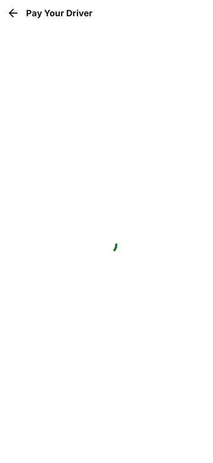<br><b>Passenger Settlement</b><br><sub>Loading</sub></td><td align="center" valign="top" width="25%">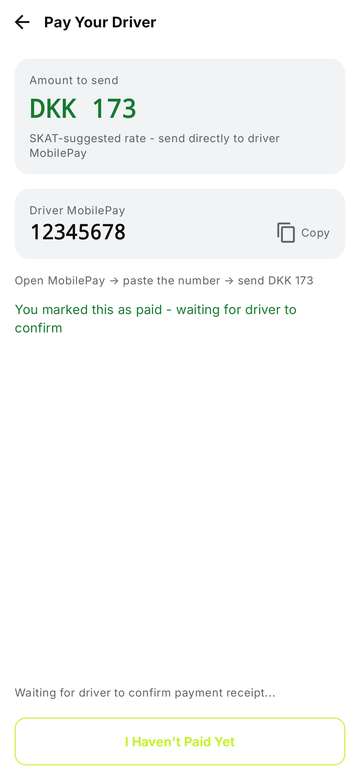<br><b>Passenger Settlement</b><br><sub>Marked as paid</sub></td><td align="center" valign="top" width="25%">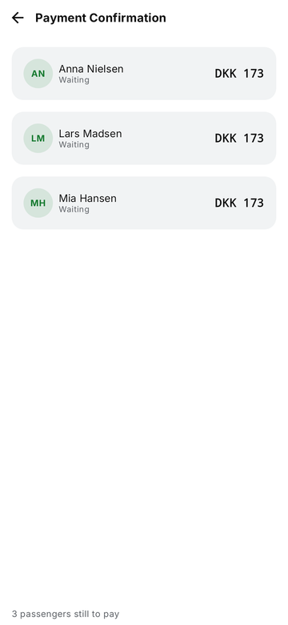<br><b>Driver Settlement</b><br><sub>All waiting</sub></td></tr>
<tr><td align="center" valign="top" width="25%">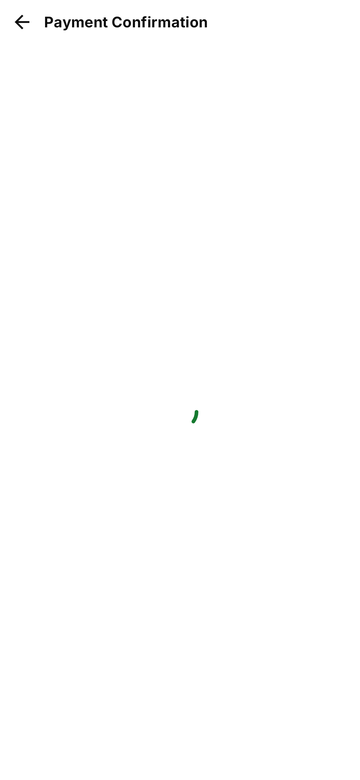<br><b>Driver Settlement</b><br><sub>Loading</sub></td><td align="center" valign="top" width="25%">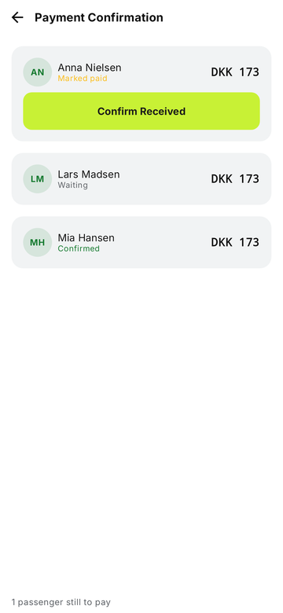<br><b>Driver Settlement</b><br><sub>Mixed payment status</sub></td><td align="center" valign="top" width="25%">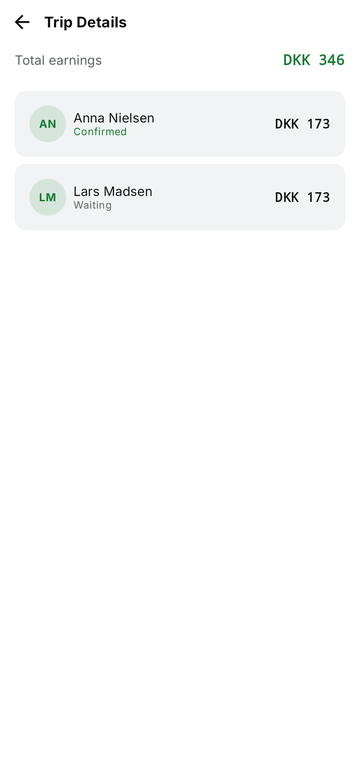<br><b>Past Trip Detail Driver</b><br><sub>Default</sub></td><td align="center" valign="top" width="25%"><br><b>Past Trip Detail Driver</b><br><sub>Loading</sub></td></tr>
</table>
</details>

<!-- screenshots:end -->

---

## Tech Stack

| Layer | Technology |
|---|---|
| Android UI | Compose Multiplatform 1.10.3 |
| iOS UI | SwiftUI (NavigationStack) |
| Shared logic | Kotlin Multiplatform, Kotlin 2.3.20 |
| Networking | Ktor 3.1.3 |
| Dependency injection | Koin |
| Serialization | kotlinx.serialization 1.8.1 |
| Async | kotlinx.coroutines 1.10.1 |
| Backend | NestJS 11, TypeScript |
| ORM | Prisma 7.7 + PostgreSQL |
| Auth | Supabase |
| Realtime | Socket.IO 4.8 |
| Job queue | BullMQ |
| Observability | Sentry (Android, iOS, API) |
| Min Android SDK | 24 (Android 7.0) |
| Target Android SDK | 36 |

---

## Getting Started

### Prerequisites

- Android Studio Meerkat or newer
- Xcode 16+
- Node.js 20+
- PostgreSQL 15+
- A Supabase project

### Environment Setup

**Backend** — copy and populate `apps/api/.env`:
```env
DATABASE_URL=postgresql://...
SUPABASE_URL=https://<project>.supabase.co
SUPABASE_SERVICE_KEY=...
GOOGLE_PLACES_API_KEY=...
SENTRY_DSN=...
```

**Android** — `local.properties`:
```
MAPS_API_KEY=...
SENTRY_DSN=...
```

**iOS** — `iosApp/Configuration/Config.xcconfig`:
```
SENTRY_DSN = ...
```

### Running the API

```bash
cd apps/api
npm install
npx prisma migrate deploy
npm run start:dev
```

### Building the Android App

```bash
# Debug APK
./gradlew :composeApp:assembleDebug

# Release bundle (requires signing config in local.properties)
./gradlew :composeApp:bundleRelease
```

### Building the iOS App

Open `iosApp/iosApp.xcodeproj` in Xcode and run, or build from the terminal:

```bash
xcodebuild build \
  -project iosApp/iosApp.xcodeproj \
  -scheme iosApp \
  -destination 'generic/platform=iOS'
```

> The KMP shared XCFramework is built automatically via the Gradle task `:shared:assembleSharedXCFramework`.

---

## Architecture

The app follows MVI (Model-View-Intent) with a clean separation of concerns:

```
UI Layer  ──►  ViewModel (shared KMP)  ──►  Repository Interface
                    │                              │
              emits UiState                  Repository Impl (Ktor)
              emits Effects                        │
                                             NestJS API
```

- **State** — immutable data class; UI observes and renders it
- **Events** — user actions sent into the ViewModel
- **Effects** — one-shot side-effects (navigation, toasts, deep links)

All API responses are wrapped in `{ "data": T }` by a global NestJS `TransformInterceptor`. The KMP layer unwraps them via `ApiEnvelope<T>` and `safeEnvelopeCall`.

---

## Learn More

- [Kotlin Multiplatform](https://www.jetbrains.com/help/kotlin-multiplatform-dev/get-started.html)
- [Compose Multiplatform](https://www.jetbrains.com/lp/compose-multiplatform/)
- [NestJS](https://nestjs.com/)
- [Ktor](https://ktor.io/)
- [Koin](https://insert-koin.io/)
